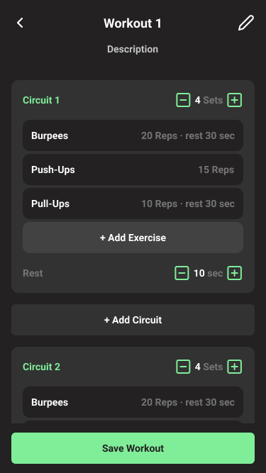
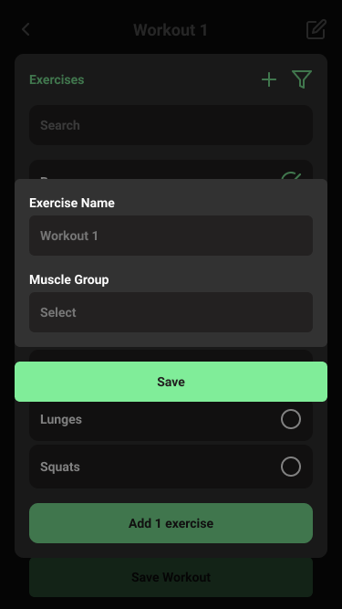
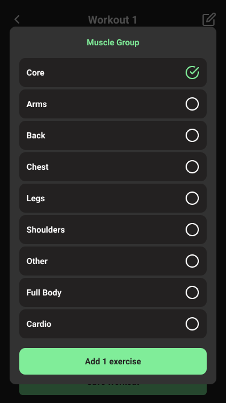
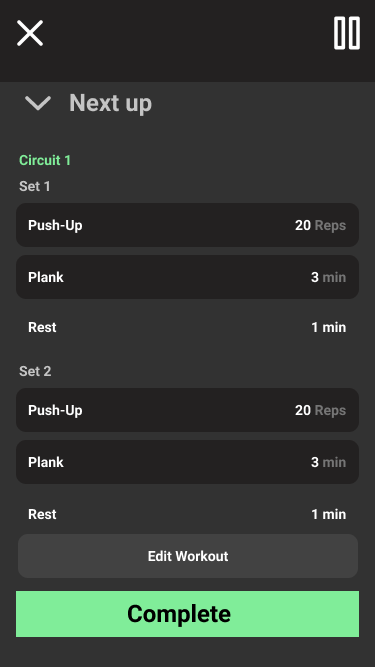

# Crush it Server-Side

This is a repo for crush-it which contains **server-side code**. The front-end code is in the different repo.

## Table of contents
* [Project Description](#project-description)
* [Technologies](#technologies)
* [Setup](#setup)
* [Features](#features)
* [DB Design](#db-design)
* [App Screenshots](#app-screenshots)

## Project Description

Crush-It is a workout builder which helps sportsmen build their workouts fast and train easily. In Crush-It you can select either predefined workouts and create your templates or select prefined workout templates. The user is of course able to create his custom workouts as well. Once you have created your custom workout or chosen one of our premade workouts, you are free to train.

This is not a real-world project but the purpose of the project is to gain more technical knowledge in the fields of front-end and back-end. My project partner and I are doing it because we want to become very fast at building MVPs. So The only purpose of the project is to become better and quicker at building MVPs.

## Technologies

- Typescript ^4.2.3
- React ^17.0.1
- Node.js ^14.15.3
- mongodb ^3.6.5
- mongoose ^5.12.3

You can check out other dependencies in the **package.json** file under the property **dependencies** and **devDependencies**.

- **Why React?** React does have several benefits in comparison to normal vanilla JS. First of all, it makes the code more readable because of its component-based structure. Additionally rendering content is faster in React because it uses techniques to minimize the number of dom operations. Furthermore, testing is easier in React because it provides its testing tools.

- **Why Node.js?** Again because it's popular and Node.js is usually a good fit with React because you can work with both technologies in javascript/typescript.

- **Why MongoDB?** Particularly I want to get familiar with the NoSQL database because I am planning to work on large projects in the future. I read that MongoDB is popular and therefore I thought it is a good fit for our project. But of course, I am aware of the advantages and disadvantages of both SQL and NoSQL databases. It's just because I had to choose between one of the databases so I went for NoSQL.

- **Why Typescript?** We using typescript to avoid searching bugs in javascript. Because of its types, the development is going much faster in comparison to javascript.

## Setup

### 1. Make sure you are in the root directory of the project.

Type this in terminal:

Unix

`username@MacBook-Pro-67 ~ % ls`

windows

`C:\Projects\...: dir`

If you are in the right directory, you will see these files:

- LICENSE
- README.md
- package.json
- Procfile
- dist
- package-lock.json       
- request.rest            
- tsconfig.json

### 2. Install Dependencies

`npm install`

After executing this command, the following folder will be created: **node_modules**. This folder contains bunch of dependencies for starting your server.

### 3. Start The Server

`npm start`

This command starts the nodejs server.

## Features

User Story

## DB Design

### Collections
* users
* workouts
* exercises
* circuits

When I started to think about modeling the schema of the database I noticed that I had to wisely decide on how to structure the database so that it won't be any efficiency problems. The **Workout Builder** page seems to be the complex one because it contains **circuits** and **exercises**.

So I came up with 3 different schemas for this use case:

### 1st Option

With this option, I had to query circuits...

`circuit=db.users.circuits.find({}).toArray()`

And then query for each circuit their corresponding exercises from the list

`exercises=db.users.circuits.find({ _id: { $in : circuit.exercises } } ).toArray()`

That means:
- 1 circuit requires 2 queries
- 2 circuits require 3 queries
- 3 cir. -> 4 queries etc.

This is probably not the best solution since we are querying a lot and therefore it's inefficient, although we would have exercise info as a stand-alone document so it's would be easier to search and update independently. 

### 2nd Option

This option is also inefficient because we have to query a lot to get **exercises** for corresponding circuits.

- 1 circuit -> 2 qeuries
- 2 circuit -> 3 qeuries 
- 3 circuit -> 4 qeuries

### 3rd Option

This option seems to have just one query operation since we are storing part of the exercise data in the circuit document. Since MongoDB's document storage limit is 16MB, it's compatible to store exercises in the circuit document since the user would store at most 10 exercises inside.

But there is one disadvantage for this solution: There is no way of accessing exercise details as stand-alone entities. That means, to change the exercise details or update them we have to change the whole list. But, still, if we compare this option with the other two options, this solution is the best for efficiency.

### End Result

## App Screenshots

### Home Page
 

### Workout Builder

### Edit Workout Dialog

### Edit Exercise Dialog

### Add Exercise Dialog

### Add Custom Exercise Dialog

### Filter Exercise

### Run Workout Repetition

### Run Workout Time

### Run Workout Routine

